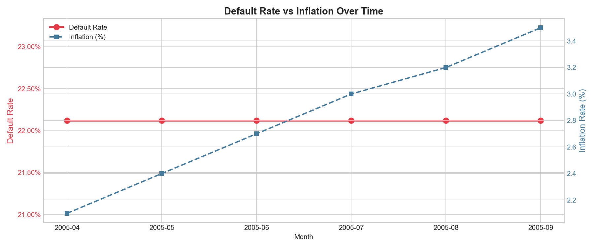
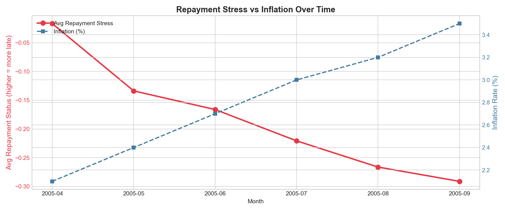
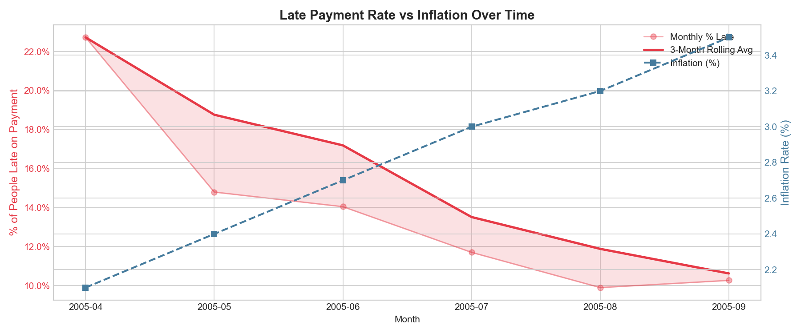
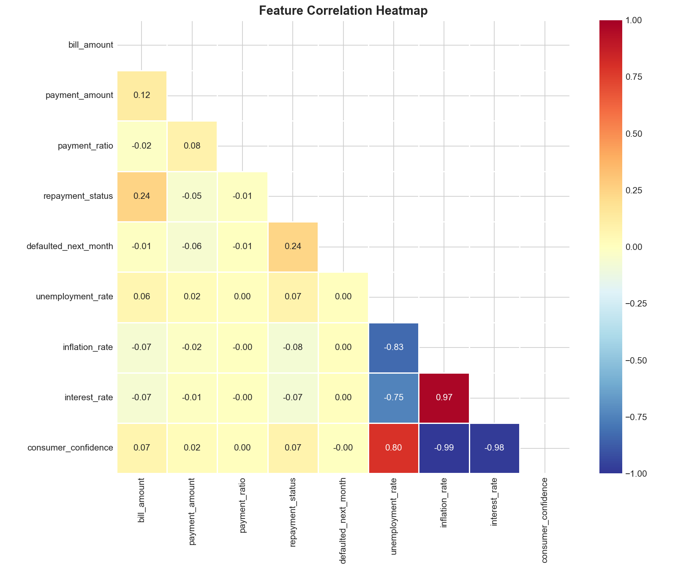
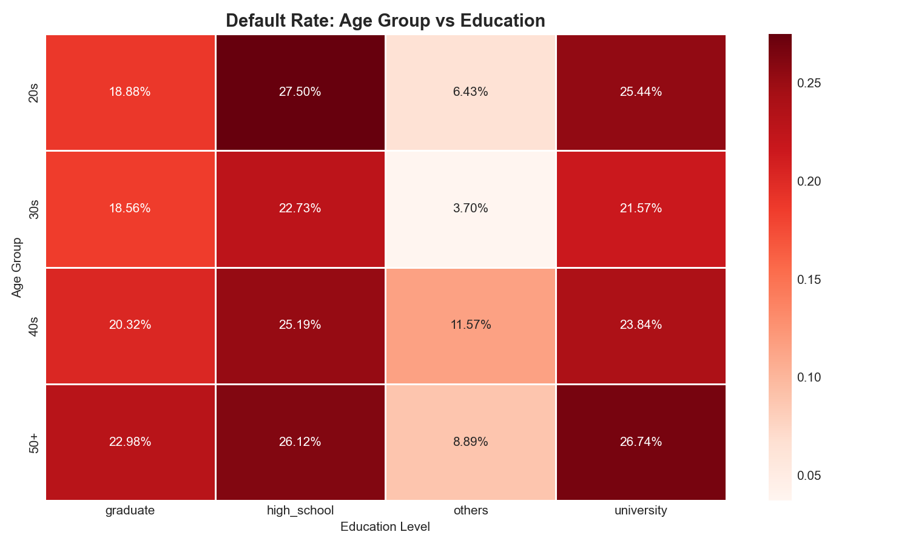
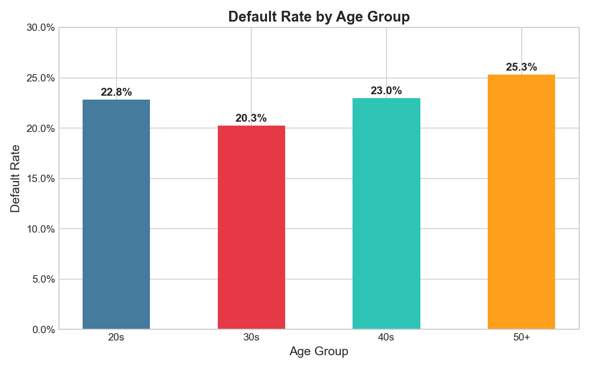

# 📊 Financial Stress Detector

> An end-to-end data analytics project analyzing how macroeconomic shifts impact consumer credit behavior — built with PostgreSQL, Python, and Power BI.


---

## 🧠 Project Overview

This project investigates whether rising inflation and unemployment rates in Taiwan (2005) caused measurable changes in consumer credit stress and default behavior. Using the UCI Credit Card Default dataset, I built a full analytics pipeline — from raw data ingestion to an interactive Power BI dashboard — uncovering several counter-intuitive findings about how people manage debt under economic pressure.

**The central question:**
> As inflation rises, do people become more or less financially stressed?

**The answer this data reveals:**
> Surprisingly, stressed customer-months FELL as inflation rose — suggesting customers became more cautious and prioritised debt repayment over discretionary spending.

---

## 📁 Project Structure
```
financial-stress-detector/
│
├── data/
│   └── credit_default.csv
│
├── sql/
│   ├── schema.sql
│   └── stress_detection.sql
│
├── notebooks/
│   ├── 01_etl.ipynb
│   ├── 02_eda.ipynb
│   └── charts (PNG files)
│
├── dashboard/
│   ├── financial_stress_dashboard.pbix
│   └── dashboard_preview.png
│
└── README.md
```

---

## 🛠️ Tech Stack

| Tool | Purpose |
|------|---------|
| PostgreSQL | Database — stores 180,000 transaction records |
| pgAdmin | SQL query tool — schema creation and stress analysis |
| Python | ETL pipeline — data cleaning and loading |
| Pandas | Data transformation and feature engineering |
| Matplotlib / Seaborn | EDA charts and visualizations |
| SQLAlchemy | Python-PostgreSQL connection |
| Power BI | Interactive dashboard |
| Jupyter Notebook | Development environment |

---

## 📦 Dataset

Source: https://www.kaggle.com/datasets/uciml/default-of-credit-card-clients-dataset

| Property | Value |
|----------|-------|
| Customers | 30,000 |
| Time period | April – September 2005 |
| Country | Taiwan |
| Total records after ETL | 180,000 |
| Target variable | defaulted_next_month (0 or 1) |

---

## 🗄️ Database Design

Star Schema — one central fact table surrounded by dimension tables.

- dim_users — customer demographics and credit limit (30,000 rows)
- dim_time — month metadata Apr–Sep 2005 (6 rows)
- fact_transactions — monthly bill, payment, repayment status (180,000 rows)
- fact_macro_indicators — monthly inflation, unemployment, interest rate (6 rows)
- v_analysis — master view joining all 4 tables
- v_stress_users — adds High Stress / Medium Stress / Normal label to every row

---

## ⚙️ ETL Pipeline

1. Extract — load credit_default.csv with header=1
2. Transform:
   - Rename columns
   - Map education codes: 1=graduate, 2=university, 3=high_school, 4=others
   - Map marriage codes: 1=married, 2=single, 3=others
   - Create age groups: 20s / 30s / 40s / 50+
   - Reshape wide to long format — 180,000 rows
   - Calculate payment_ratio = payment_amount / bill_amount
   - Generate synthetic macro indicators
3. Load — insert into PostgreSQL via SQLAlchemy

---

## 📈 EDA Key Findings

### Chart 1 — Default Rate vs Inflation

- Default rate flat at 22.1% across all months
- Inflation rises steadily 2.1% to 3.5%

### Chart 2 — Repayment Stress vs Inflation

- Average repayment status becomes more negative as inflation rises
- More customers paying in full as economic pressure builds

### Chart 3 — Late Payment Rate vs Inflation

- KEY FINDING: X-shaped chart — late payments FALL as inflation RISES
- Late payments dropped from 22% to 10% while inflation rose from 2.1% to 3.5%

### Chart 4 — Correlation Heatmap

- repayment_status vs defaulted_next_month = 0.24 (strongest predictor)
- inflation_rate vs interest_rate = 0.97
- consumer_confidence vs inflation_rate = -0.99

### Chart 5 — Cohort Heatmap (Age x Education)

- High school = riskiest education level across ALL age groups (27.5%)
- Others category = safest (3.7%)
- Education is a stronger predictor than age

### Chart 6 — Default Rate by Age Group

- 20s: 22.8% | 30s: 20.3% | 40s: 23.0% | 50+: 25.3%
- U-shaped pattern — 30s are safest, 50+ are highest risk

---

## 🔍 Stress Detection Results

### Stress Label Definition

| Label | Conditions |
|-------|-----------|
| High Stress | 2+ months late AND paying less than 10% of bill AND bill over 50,000 NTD |
| Medium Stress | 1+ month late AND paying less than 30% of bill |
| Normal | All other cases |

### Overall Distribution

| Label | Rows | Percentage |
|-------|------|-----------|
| Normal | 156,816 | 87.1% |
| Medium Stress | 16,557 | 9.2% |
| High Stress | 6,627 | 3.7% |

### Monthly Trend

| Month | High Stress % | Medium Stress % | Normal % |
|-------|-------------|----------------|---------|
| Apr 2005 | 4.0% | 17.5% | 78.5% |
| May 2005 | 4.5% | 8.8% | 86.7% |
| Jun 2005 | 4.0% | 8.8% | 87.2% |
| Jul 2005 | 3.4% | 7.6% | 89.0% |
| Aug 2005 | 3.1% | 6.3% | 90.7% |
| Sep 2005 | 3.1% | 6.3% | 90.6% |

HIGH_STRESS fell from 4.5% to 3.1% — a 31% relative reduction — while inflation rose 67%.

---

## 📊 Power BI Dashboard

Dark cyberpunk theme (cyan + purple + pink on black background).

Visuals included:
- 4 KPI cards — Total customers, Default rate, High stress %, Avg payment ratio
- Line chart — Late payment rate vs inflation (X-shape pattern)
- Bar chart — Stress distribution
- Column chart — Default rate by age group
- Matrix heatmap — Cohort default rate (age x education)
- Bar chart — Monthly stress trend
- 4 Slicers — Age group, Education, Marriage, Stress label
- Insight cards — 4 key findings

---

## 💡 Key Findings Summary

1. As inflation rose, late payments FELL — customers prioritised debt repayment over spending
2. Education level predicts default better than age — high school educated customers default most
3. HIGH_STRESS customer-months declined 31% from May to September 2005
4. 30s age group is the safest cohort with the lowest default rate at 20.3%
5. Macro indicators are nearly perfectly correlated — inflation, interest rates, consumer confidence move together
6. Only 3.7% hit all three HIGH_STRESS criteria — but catching them early gives maximum intervention time

---

## 🚀 How to Run

1. Clone the repo
```
git clone https://github.com/yourusername/financial-stress-detector.git
```

2. Install dependencies
```
pip install pandas sqlalchemy psycopg2-binary matplotlib seaborn jupyter
```

3. Create database in pgAdmin
```
CREATE DATABASE financial_stress_db;
```

4. Run schema.sql in pgAdmin Query Tool

5. Run 01_etl.ipynb in Jupyter

6. Run 02_eda.ipynb in Jupyter

7. Run stress_detection.sql in pgAdmin

8. Open financial_stress_dashboard.pbix in Power BI Desktop

---

## 👤 Author

Built as a portfolio project to demonstrate end-to-end data analytics skills across SQL, Python, and Business Intelligence tools.

---

## 📄 License

MIT License
